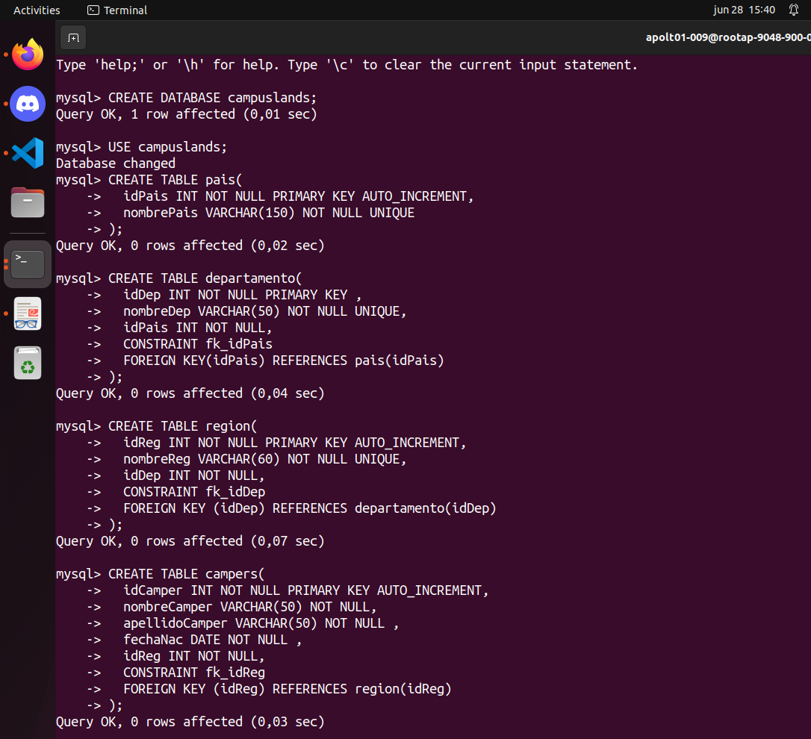

Parte de base de datos el script está guardado en un archivo llamado campuslands.sql y se realizó con el terminal.

El id de campers lo cambie de varchar a int autoincremental porque así es como nos tienen nombrados acá, por un ID. 

El ingreso de los datos se realiza así : Para los paises

para los departamentos

para las regiones: 

para insertar campers:

Ahora se realiza la parte de la conexión.