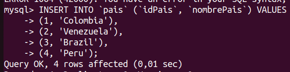
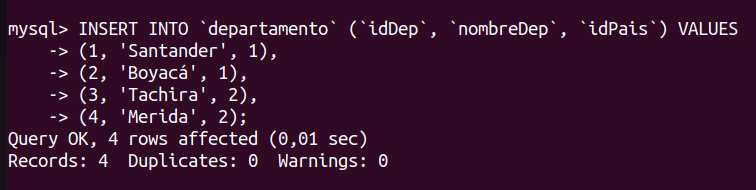
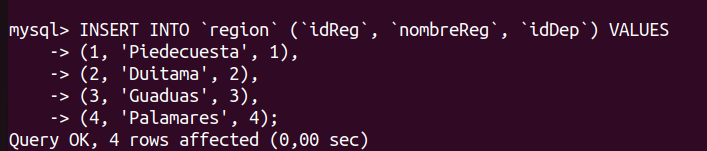
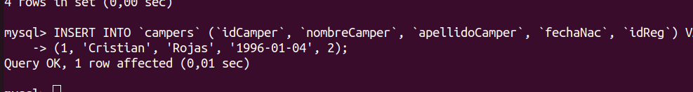

# TEST PHP EN CAMPUS LANDS

Este repositorio contiene el ejercicio que se dejó en el programa de formación. Consiste en un MODULO DE ADMINISTRADOR PARA LA GESTIÓN DE INFORMACION DE LA EMPRESA CAMPUSLANDS.

Nombre de camper: Cristian Camilo Rojas

Curso: M3


## 1) Base de datos


La base de datos está guardada en un archivo llamado campuslands.sql y se realizó con el terminal.


El id de campers lo cambie de varchar a int autoincremental porque así es como nos tienen nombrados acá, por un ID. 

El ingreso de los datos se realiza así : Para los paises




para los departamentos



para las regiones: 



para insertar campers:




## 2) Conexión PDO con POO

La conexión se realizó con la librería bramus/router. 


## ¿Como usar este repositorio?

* Debe tener instalado php y composer.
* Descargar el repositorio o clonarlo en el pc.
* Entrar a el directorio donde se descargó el repositorio y abrir la terminal, luego escribir en la terminal:

```
    composer install
```

* Despúes de instalar las librerias necesarias ir a los archivos. Faltó parte la parte del front.
